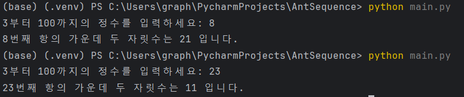

# look and say sequence

읽고 말하는 대로 다음 항을 도출하는 수열이다. 보고 말하기 수열이라고도 하며, 프랑스의 유명 소설가 베르나르 베르베르의 소설<개미>에 등장하여 한국에서는 개미 수열이라고도 불린다.


### 설명

1. 첫 번째 항이 Ln= 1 이라고 할 때,
2. 이전 항의 이웃한 같은 숫자들을 묶는다.
   - 이전 항이 111221일 경우 (3,1),(2,2),(1,1)
3. 묶인 숫자들의 숫자와 개수를 붙여 쓴다.
   - (3,1),(2,2),(1,1) ⇒ 312211
4. 2와 3을 반복한다.

### 실행 방법
1. **저장소 클론**
    - HTTPS 사용시:
   ```bash
   git clone https://github.com/Eunyoungkim0/ant_sequence.git
   ```
   
   - SSH 사용시:
   ```bash
   git clone git@github.com:Eunyoungkim0/ant_sequence.git
   ```

2. **프로그램 실행**
   - main.py가 위치한 디렉토리에서 다음 명령어 실행
   ```bash
   python main.py
   ```
   - 3부터 100까지의 정수 입력
   - 예시:
   